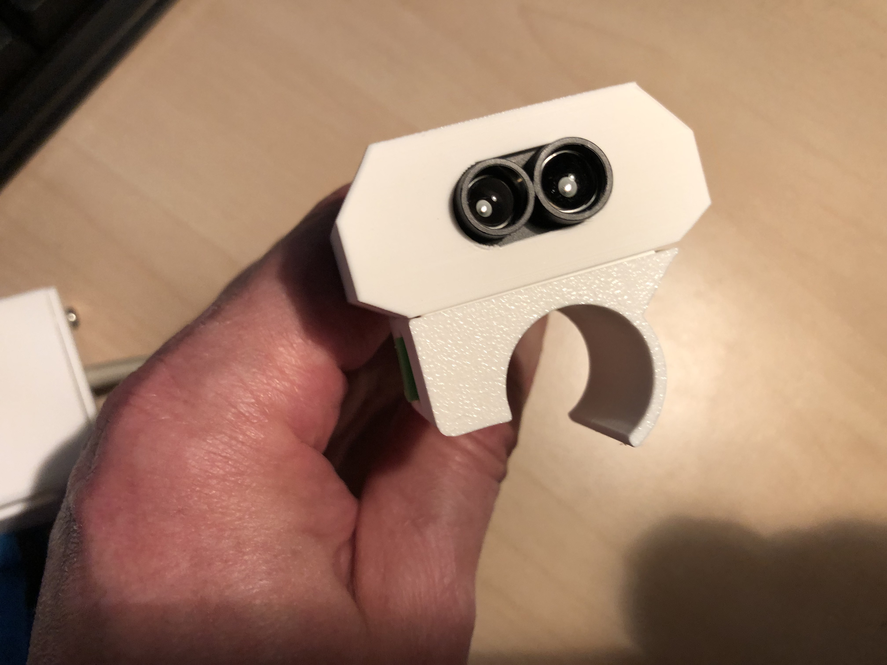
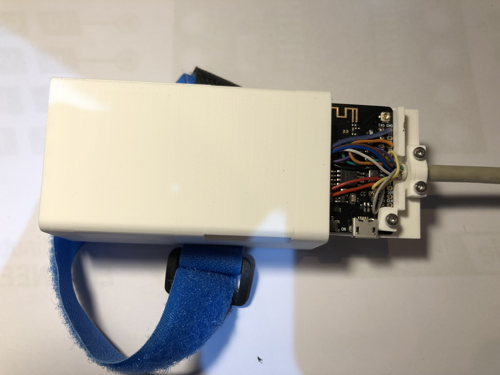

# Virtual blind walking stick

This sketch turns a Benewake TFMini-S / TFMini-Plus lidar rangefinder into a parking-sensor-style audible proximity alert, streamed wirelessly to a Bluetooth A2DP speaker instead of a wired buzzer. Beep rate increases as the sensed object gets closer, and pitch steps up by an octave every 4 m of range.
The idea is that a visual impaired person can use this to navigate the environment simular to using a walking stick. The advantage of this electronic version is that the range is much larger, up to 12 metre and no toughing of the object is necessary. So for example a glass window can be measured instead of using a stick to tap it.





## How it works

1. **Sensing** — A TFMini-S lidar module is read over UART (ESP32 `HardwareSerial` UART1) via the `TFMPlus` driver library, reporting distance in cm at up to 100 Hz.
2. **Mapping distance → sound**
   - **Beep rate**: distance is linearly mapped from `DIST_MIN_MM`–`DIST_MAX_MM` (10 cm–12 m) to an inter-beep delay of `BEEP_DELAY_MIN_MS`–`BEEP_DELAY_MAX_MS` (80–800 ms), so closer objects beep faster.
   - **Pitch**: range is split into 4 m-wide octave bands. The farthest band plays at `BASE_FREQUENCY_HZ` (220 Hz); each band closer than that doubles the frequency, so the nearest band plays four octave-steps higher.
   - Both are recomputed continuously (non-blocking sequencer), so a sudden distance change is reflected within one `loop()` iteration (~10 ms) rather than waiting out a stale timing window.
3. **Sound synthesis** — Tones are generated in software as a small additive sine synthesis (fundamental + 4 harmonics) inside the Bluetooth audio callback (`get_sound_data`), with a short envelope ramp on beep/mute transitions to avoid audible clicks.
4. **Output** — Audio is streamed over Bluetooth A2DP (`ESP32-A2DP` library) to a paired speaker/receiver named `"B66"`, with auto-reconnect enabled.
5. **Controls**
   - A physical button (`PIN_KEY`, active-low, debounced) toggles mute; an LED (`PIN_LED`) reflects the current mute state.
   - Volume can be adjusted at runtime by sending `+` / `-` characters over the Serial console (steps of 5, clamped 0–127).

## Hardware

| Signal | ESP32 Pin | Notes |
|---|---|---|
| LED (mute indicator) | GPIO 22 | Active-high |
| Mute button | GPIO 23 | `INPUT_PULLUP`, active-low |
| Lidar RX (ESP32 RX) | GPIO 18 | TFMini-S TX → ESP32 RX |
| Lidar TX (ESP32 TX) | GPIO 21 | TFMini-S RX ← ESP32 TX |

The TFMini-S's signal pins are dual-purpose (UART RX/TX or I²C SDA/SCL). At boot, `ensureLidarUARTMode()` briefly opens the same two pins as I²C and unconditionally sends the sensor's "switch to UART mode" + "save settings" command bytes, in case a previous session left it in I²C mode. This is done unconditionally (not gated on an address probe) because a marginal I²C bus can make presence-detection unreliable. The pins are then released and reopened as UART. This step can be skipped by setting `SKIP_I2C_MODE_CHECK` to `1`.

## Configuration

Key tunables are grouped near the top of the source file:

- **Distance range**: `DIST_MIN_MM`, `DIST_MAX_MM` — sensor range mapped to sound (defaults: 10 cm–12 m, the TFMini-S's full rated range).
- **Beep timing**: `BEEP_DELAY_MIN_MS`, `BEEP_DELAY_MAX_MS`, `BEEP_ON_MS` — inter-beep gap range and fixed beep length.
- **Pitch**: `OCTAVE_BAND_MM`, `BASE_FREQUENCY_HZ` — width of each octave band and the base (farthest-band) frequency.
- **Volume**: `VOLUME_MIN`, `VOLUME_MAX`, `VOLUME_STEP` — runtime volume control bounds via Serial `+`/`-`.
- **Mute debounce**: `KEY_DEBOUNCE_MS`.
- **`DEBUG_SENSOR`** (0/1) — enables verbose Serial logging (raw sensor readings, a 1 Hz heartbeat, and a raw UART byte dump at boot). Off by default since each `Serial.printf()` costs ~1–2 ms and can add loop jitter.
- **`SKIP_I2C_MODE_CHECK`** (0/1) — skips the boot-time I²C mode-recovery step described above.

## Behavior notes

- If the sensor hasn't produced a new frame since the last `loop()` call, the last known-good distance is reused rather than treated as "out of range," so beeping stays smooth between UART frames.
- A reading is treated as invalid (and the beeper goes silent) when the TFMini-S reports a non-positive distance or a signal-strength ("flux") value below 100 — both indicate an unreliable measurement (target too close/far, low reflectivity, or ambient light saturation).
- The beep sequencer keeps running on its normal schedule even while muted; muting is applied downstream in the audio callback, so un-muting resumes in sync with the current distance instead of needing to "catch up."
- All audio-callback state (`toneState`, `muted`) is `volatile`, since it's written from `loop()` and read from the separate Bluetooth audio task.

## Dependencies

- [Arduino core for ESP32](https://github.com/espressif/arduino-esp32)
- [`TFMPlus`](https://github.com/budryerson/TFMini-Plus) — Benewake TFMini-Plus/TFMini-S UART driver
- [`ESP32-A2DP`](https://github.com/pschatzmann/ESP32-A2DP) (`BluetoothA2DPSource`)
- `Wire` (bundled with the ESP32 core)

## Usage

1. Wire the TFMini-S to the ESP32 as described above, plus the mute button and LED.
2. Install the dependencies listed above in your Arduino/PlatformIO environment.
3. Flash the sketch. On boot it will:
   - attempt to recover the lidar from I²C mode if needed,
   - verify UART communication with the sensor (halting with a Serial error if it fails),
   - set the sensor to continuous 100 Hz output,
   - start advertising/connecting as Bluetooth source `"B66"`.
4. Pair `"B66"` with your Bluetooth speaker/receiver (auto-reconnect is enabled for subsequent boots).
5. Open the Serial Monitor at 115200 baud to see status messages, and optionally send `+`/`-` to adjust volume.
6. Press the button on `PIN_KEY` to mute/unmute; the LED tracks mute state.

## Troubleshooting

- **"TFMini-S init failed — check wiring!"** at boot: the firmware-version handshake failed. Check power, and that RX/TX aren't swapped. Set `DEBUG_SENSOR` to `1` to see a raw 1-second UART byte dump at boot, which helps distinguish "nothing arriving" (power/baud/wiring) from "garbled data" (baud mismatch or swapped lines) from "sensor alive but command handshake failing."
- **No audio at all**: check the Serial log for A2DP connection-state messages (`a2dpConnectionStateChanged`) to confirm the Bluetooth link is actually established — audio silently doesn't play if it isn't. With `DEBUG_SENSOR` enabled, the 1 Hz heartbeat log also reports whether the beep sequencer is going active and whether A2DP reports connected.
- **Suspect the sensor is stuck in I²C mode**: leave `SKIP_I2C_MODE_CHECK` at `0` (default) so `ensureLidarUARTMode()` runs at boot; it will attempt to switch and save UART mode regardless of whether it can confirm the sensor's current state.# TTGO T7 v1.3 (ESP32) — PlatformIO Project

PlatformIO configuration for the **LilyGO TTGO T7 v1.3** (Mini32 / ESP32-WROVER-B), targeting Arduino framework projects that use LiDAR distance sensing (TFMini Plus) and Bluetooth A2DP audio.

## Hardware

- **Board:** LilyGO TTGO T7 v1.3 (Mini32)
- **Module:** ESP32-WROVER-B
- **PSRAM:** 4 MB
- **Flash:** 4 MB (default partition scheme, OTA-capable)

## Environment

| Setting | Value |
|---|---|
| Environment name | `ttgo-t7-v13` |
| Platform | `espressif32@6.3.2` |
| Board | `esp32dev` |
| Framework | `arduino` |

## Serial / Upload Settings

| Setting | Value |
|---|---|
| Monitor speed | `115200` |
| Monitor port | `/dev/ttyUSB2` |
| Upload speed | `921600` |
| Upload port | `/dev/ttyUSB2` |

> Adjust `monitor_port` / `upload_port` to match your system (e.g. `/dev/ttyUSB0`, `COM5`, etc.).

## Build Flags

- `-DBOARD_HAS_PSRAM` — enables the 4 MB PSRAM on the WROVER-B module
- `-mfix-esp32-psram-cache-issue` — required compiler workaround for ESP32 PSRAM cache bug
- `-DARDUINO_ESP32_DEV` — identifies the board variant to the Arduino core
- `-DARDUINO_USB_CDC_ON_BOOT=0` — disables USB CDC on boot to avoid an undefined-reference error on `Serial1`

## Partition Scheme

Uses the `default.csv` partition table (4 MB flash) with OTA update support.

## Optional Settings

The following are commented out in `platformio.ini` and can be enabled if needed (e.g. for PSRAM-heavy tasks or custom flash configurations):

```ini
; board_build.f_cpu = 240000000L
; board_build.f_flash = 80000000L
; board_build.flash_mode = dio
```

## Library Dependencies

| Library | Purpose |
|---|---|
| [`budryerson/TFMPlus`](https://github.com/budryerson/TFMPlus) | Driver for the TFMini Plus LiDAR distance sensor |
| [`ESP32-A2DP`](https://github.com/pschatzmann/ESP32-A2DP) | Bluetooth A2DP audio source/sink for ESP32 |
| [`arduino-audio-tools`](https://github.com/pschatzmann/arduino-audio-tools) | Audio processing utilities for Arduino/ESP32 |

## Getting Started

1. Install [PlatformIO](https://platformio.org/) (VS Code extension or CLI).
2. Clone this repository and open it in PlatformIO.
3. Connect the TTGO T7 v1.3 board via USB and confirm the serial port matches `upload_port` / `monitor_port`.
4. Build and upload:
   ```bash
   pio run -e ttgo-t7-v13 -t upload
   ```
5. Open the serial monitor:
   ```bash
   pio device monitor -e ttgo-t7-v13
   ```

## Notes

- If you encounter an undefined reference to `Serial1`, confirm `ARDUINO_USB_CDC_ON_BOOT=0` is set (already included above).
- PSRAM must remain enabled (`BOARD_HAS_PSRAM`) for any PSRAM-heavy audio or buffering tasks.
